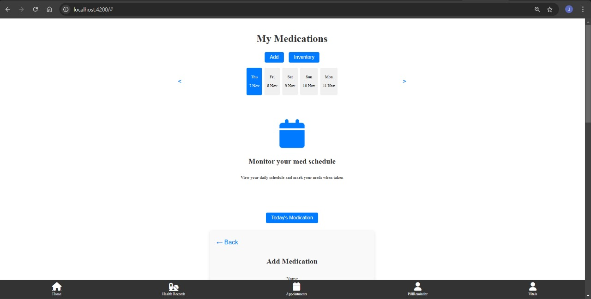
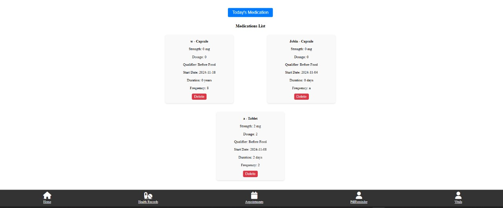
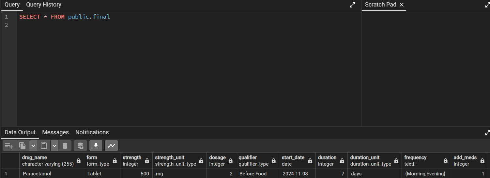
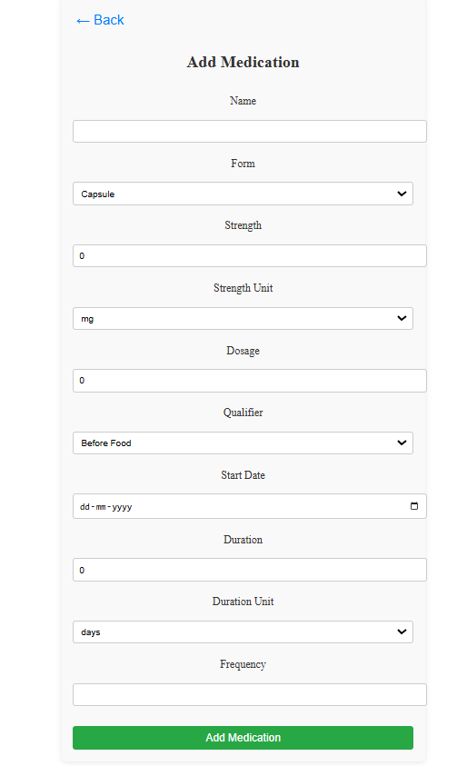

# Pills Management

## Overview

This is a **Medications Management System** that allows users to manage and track their medications, view their daily medication schedule, and maintain an inventory of medication items. The application includes a calendar for scheduling medications, an "Add Medication" form to input new medication details, and a section for tracking the user's medication inventory.

This system is built using **Angular** for the frontend and provides a smooth and interactive experience for users to manage their medication routines.

## Features

### 1. Medications List
- View a list of medications with details like name, form, strength, dosage, frequency, and start date.
- Each medication can be deleted from the list.

### 2. Add Medication
- Add new medications to the system using a detailed form that allows you to input information such as medication name, form, strength, dosage, frequency, start date, and duration.

### 3. Inventory List
- Maintain an inventory of medication items.
- Add new items to the inventory, specifying their name and quantity.
- Delete items from the inventory list.

### 4. Calendar for Medication Schedule
- A date slider allows the user to navigate through dates.
- The user can select dates to monitor the medications taken on specific days.

### 5. Today's Medication
- A button to display the medications for the current day, helping the user stay on top of their medication schedule.

### 6. Navigation Bar
- A bottom navigation bar that provides quick access to key sections, such as Home, Health Records, Calendar, Pill Reminder, and Vitals.






## How to Run

### Prerequisites:
- **Node.js** and **npm** (Node Package Manager) must be installed on your system.
- **Angular CLI** is required for building and running Angular applications.

### Steps:

1. **Clone the Repository**:
   ```bash
   git clone https://github.com/your-username/medications-management.git
   cd medications-management

2. Install Dependencies: After cloning the repository, install the necessary dependencies by running:

```
npm install
```
Run the Application: Start the development server by running:
```
ng serve
```
Open the Application: Once the server is running, open your web browser and go to:

```
http://localhost:4200
```

Additional Features:
You can add and remove medications and inventory items using the provided forms.
Medication details are dynamically displayed based on the selected date.
The calendar allows users to scroll through dates and monitor their medication schedule.
Technologies Used
Angular: Frontend framework for building dynamic user interfaces.
Font Awesome: Icons for UI elements like calendar, home, and medication-related icons.
CSS: Custom styling to manage the layout and design of the app.
